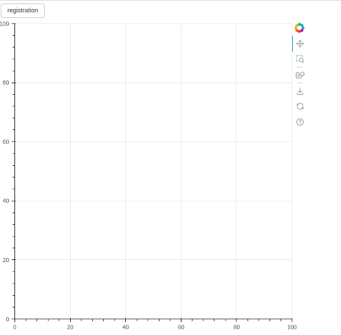
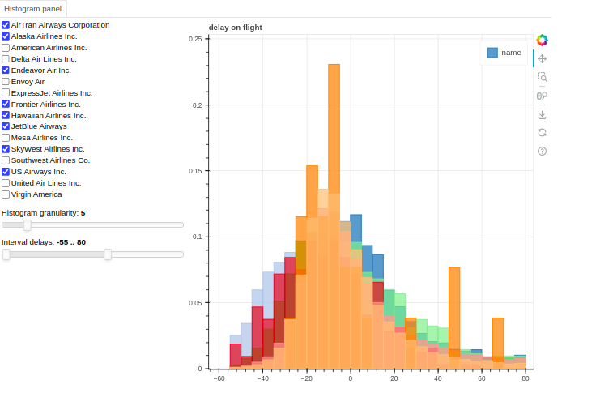
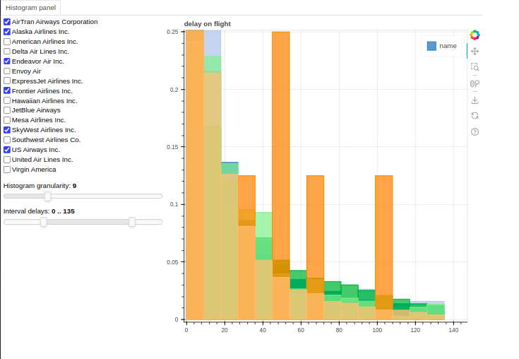
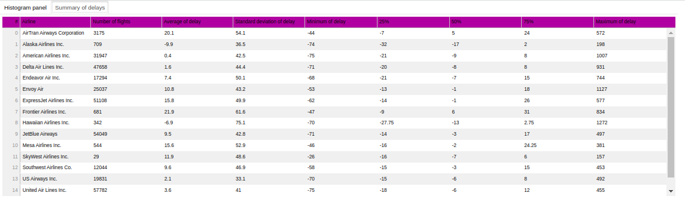
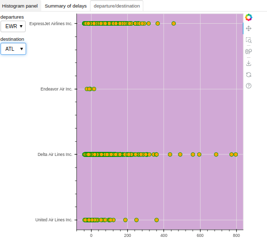

# numpy-pandas-bokeh

### In this repository, I worked on the basic concepts of linear algebra and multi-dimensional space using the `Numpy` and `Pandas` libraries, as well as data display using `matplotlib` and the `Bokeh` library.

## Installation
Provided you already have NumPy, Matplotlib, and Pandas already installed, the `imutils` package is completely `pip`-installable:

<pre>$ pip install bokeh</pre>

## What is Bokeh library ?
Bokeh is an interactive visualization library for modern web browsers. It provides elegant, concise construction of versatile graphics and affords high-performance interactivity across large or streaming datasets. Bokeh can help anyone who wants to create interactive plots, dashboards, and data applications quickly and easily.

For more information, you can check the following site: 
[Bokeh Documentation](https://docs.bokeh.org/en/latest/docs/first_steps/installation.html)

## Executing
### Run
In the bokeh_server folder, we created a server using the bokeh library that runs as follows
```shell
cd <bokeh_server>
bokeh serve --show main.py
```


In this part, using the `main.py` file, we were able to display a shape of **bokeh** in a simple way
#### Output:


In this part, using the `flight.py` and `histogram.py` files that flight is main function, we were able to use the histTab function of the Histogram Panel to change any of the items we needed
#### Output 1:


#### Output 2:


In this part, using the `flight.py` and `histogram.py` and `table.py` files that flight is main function, we were able to use the histTab function of the Histogram Panel to change any of the items we needed and also we add second table that we can see all of information we needed.

For more information about datatable, you can check the following site: 
[Data Table Documentation](https://docs.bokeh.org/en/latest/docs/reference/models/widgets.tables.html#bokeh.models.widgets.tables.DataTable)
#### Output 3:



In this part, using the `route.py` file that flights.py is main function, In this function, we can display the delay of airlines between two routes

For more information about source code formatters, you can check the following site: 
[Source code for bokeh.models.formatters](https://docs.bokeh.org/en/0.12.4/_modules/bokeh/models/formatters.html)

For more information about formatters, you can check the following site: 
[formatters Documentation](https://docs.bokeh.org/en/2.4.1/docs/reference/models/formatters.html)
#### Output 4:

